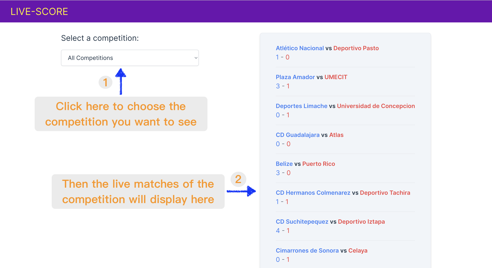
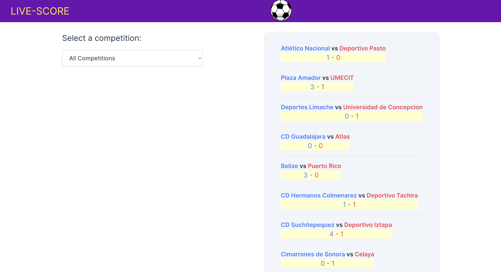

# Live-Match

Live-Match is a web page that lists all the live matches, in which the user can filter the matches by a competition so only the matches from a given competition are displayed.



When the score of a match changes, the background of the match would change to light yellow to indicate users that the match has been updated. At the same time there will be a scoccer on the top of the page, running from left to right, to indicate one team gets a score.



## How to use

1. Clone the repository

```bash
git clone https://github.com/s-zx/Live-Match.git
```

2. Install dependencies

```bash
npm install
```

3. Run the application

```bash
npm run dev
```
